<h3> 👩‍💻  About Me </h3>

I'm Artur, or Stallum, from Brazil  - 🔭 I’m working as a Backend Dev - 📚 I'm currently learning Software Engineering and Data Science - ⚡ In my free time I read

 

<!-- ### 🛠 main skills -->

<h3>main skills</h3>

  

 
<h3><code>voce@github ~ $ ./contributions.sh</code></h3>

